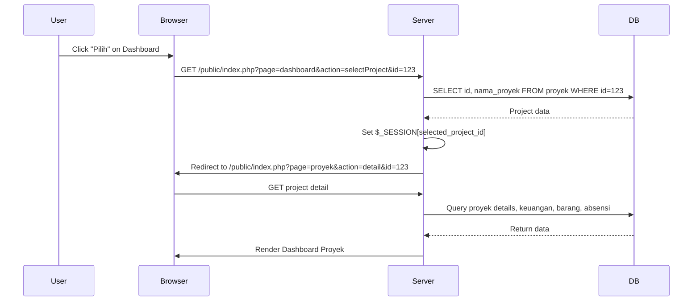

# Sequence Diagram — Selecting a Project

```mermaid
sequenceDiagram
    participant User
    participant Browser
    participant Server
    participant DB

    User->>Browser: Click "Pilih" on Dashboard
    Browser->>Server: GET /public/index.php?page=dashboard&action=selectProject&id=123
    Server->>DB: SELECT id, nama_proyek FROM proyek WHERE id=123
    DB-->>Server: Project data
    Server->>Server: Set $_SESSION[selected_project_id]
    Server->>Browser: Redirect to /public/index.php?page=proyek&action=detail&id=123
    Browser->>Server: GET project detail
    Server->>DB: Query proyek details, keuangan, barang, absensi
    DB-->>Server: Return data
    Server->>Browser: Render Dashboard Proyek
```
